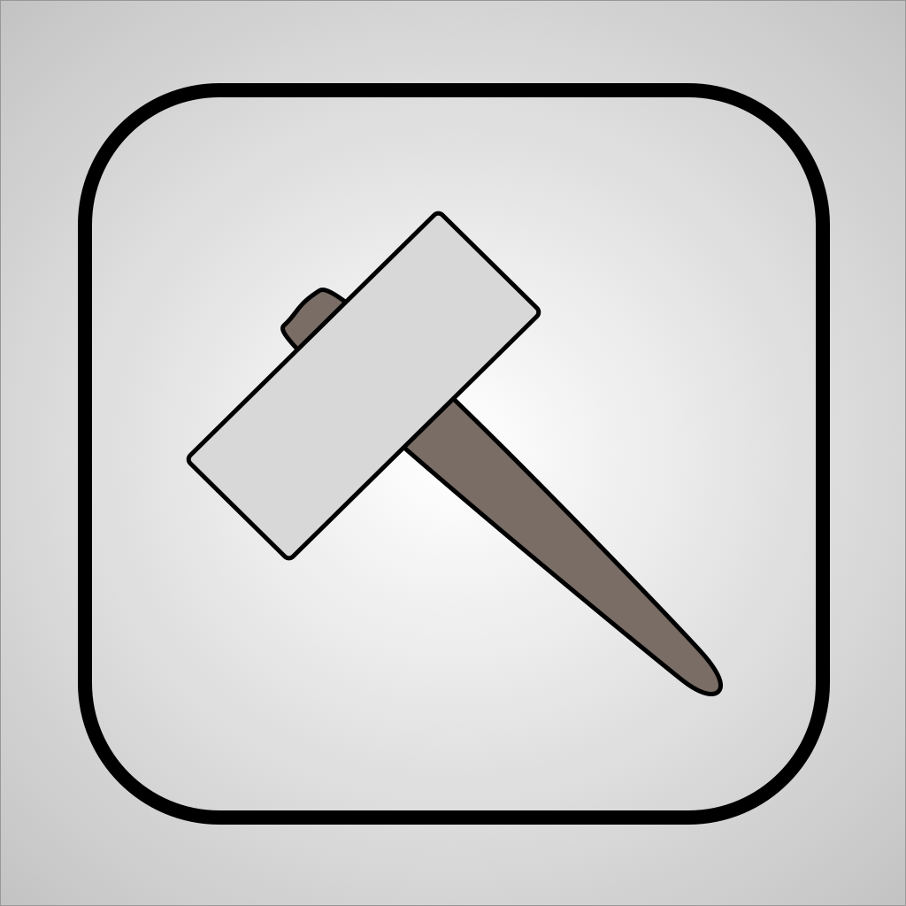
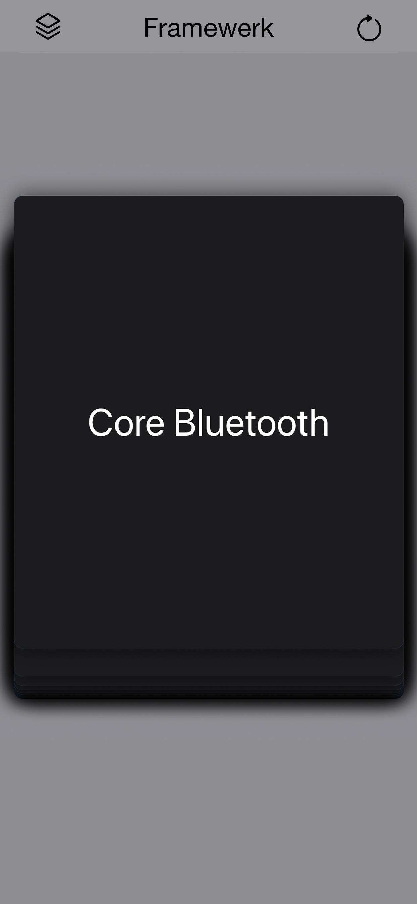
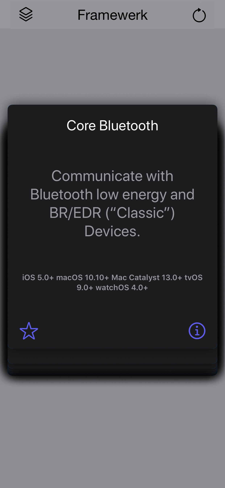
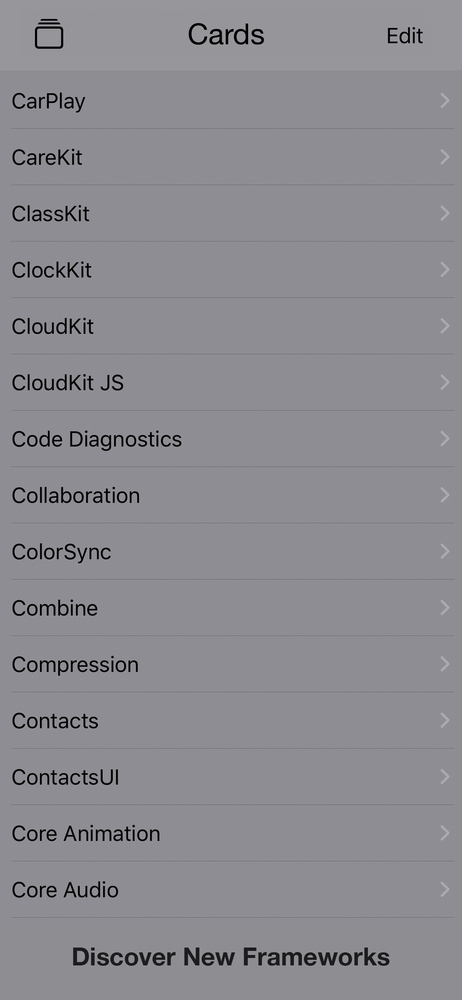

# Framewerk 

	

#### There are so many frameworks provided today, do you know about them all?

## Motivation

Learn SwiftUI and help discover new frameworks I've never used before. Share with everyone else 🙂

## The Data

The transpiled data driving this application is free and open to anyone at `Framewerk/db.json`, give a shout out if you find it useful 😁 I plan to expand and keep it updated with [releases](https://developer.apple.com/documentation/)

## Features

- All cards are fully customizable, feel free to remove all cards and make your own deck.
- Dark mode support
- Always offline mode
- SwiftUI implementation
- iPad & iOS, landscape & portrait mode
- watchOS support

#### App Images

	
	
	

#### Terms

- [Privacy Policy](./privacy.md)
- [Terms & Conditions](./terms.md)
